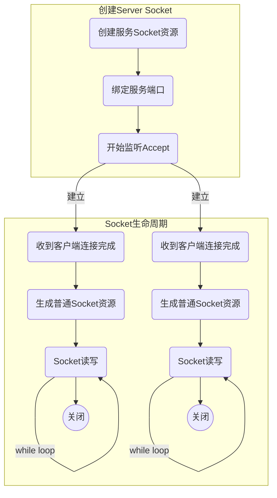

# 基础概念介绍

## 1. 一个简单服务器的基本流程



## 2. 一切皆资源

在Linux世界里，所有的资源都用描述符来表示，且对于IO资源都虚拟化为了文件，所以IO的描述符都叫文件描述即fd (file descriptor)。

在简单服务器里，主要有两类资源，即服务端Server Socket以及普通连接Socket。
- ServerSocket负责服务端口监听，当有请求进来时建立与客户端通信的socket连接。
- 普通Socket负责与客户端的读写通信。

例如Http是80端口，服务前监听80端口，然后每接收到一个请求，则建立一个普通的Socket。建立完Socket后，此后与客户端通信都只与这个socket有关，与ServerSocket无关了。

## 3. Bio v.s. Nio

Bio: 顾名思义，在等待资源ready的时候都会阻塞，例如accept以及read和write。操作系统默认行为就是阻塞的，此时如果资源没有准备好，就会阻塞当前线程。

由于IO会阻塞线程，所以对于BIO而言，就会有one connection per thread模型，即一个连接(connection)需要配一个线程。这种模式在大量连接时会存在缺陷，例如有一万个用户连接，就需要创建一万个线程，而线程也是要耗不少资源的，假如一个线程占内存512K，则一万个线程需要5G内存，所以导致难以支持一万个连接，更多细节请查看C10K问题。 （一个衍生：创建一个线程需要多少资源）

为了解决C10K问题，为此引入了nio。顾名思义，nio是指IO不会阻塞，但nio重点并不是为了非阻塞，为的是**通过非阻塞进而引入的线程模型的变化，即可以通过利用一个线程来管理多个连接（Connection）资源，即multiple connection per thread模型**。

# Java Nio
先以一个简单的EchoServer为例，来介绍下Java Nio涉及到的核心知识。

## 1. 简单EchoServer示例
```java
package com.gaocher.learning.server.javanio;

import java.io.IOException;
import java.net.InetSocketAddress;
import java.net.ServerSocket;
import java.nio.ByteBuffer;
import java.nio.channels.SelectionKey;
import java.nio.channels.Selector;
import java.nio.channels.ServerSocketChannel;
import java.nio.channels.SocketChannel;
import java.util.Iterator;
import java.util.Set;

/**
 * @author Isaac Gao
 * @Date 2019/12/19
 */
public class EchoServer {
  private static Selector selector;
  public static void main(String[] args) {
    try {
      selector = Selector.open();
//            We have to set connection host, port and non-blocking mode
      ServerSocketChannel socket = ServerSocketChannel.open();
      ServerSocket serverSocket = socket.socket();
      serverSocket.bind(new InetSocketAddress("localhost", 8089));
      socket.configureBlocking(false);
      int ops = socket.validOps();
      SelectionKey register = socket.register(selector, ops, null);
      while (true) {
        selector.select();
        Set<SelectionKey> selectedKeys = selector.selectedKeys();
        Iterator<SelectionKey> i = selectedKeys.iterator();

        while (i.hasNext()) {
          SelectionKey key = i.next();

          if (key.isAcceptable()) {
//                        New client has been accepted
            handleAccept(socket, key);
          } else if (key.isReadable()) {
//                        We can run non-blocking operation READ on our client
            String data = handleRead(key);
            handleWrite( data, (SocketChannel)key.channel());
          }
          i.remove();
        }
      }
    } catch (IOException e) {
      e.printStackTrace();
    }
  }

  private static void handleAccept(ServerSocketChannel mySocket,
      SelectionKey key) throws IOException {

    System.out.println("Connection Accepted...");

    // Accept the connection and set non-blocking mode
    SocketChannel client = mySocket.accept();
    client.configureBlocking(false);

    // Register that client is reading this channel
    client.register(selector, SelectionKey.OP_READ);
  }

  private static String handleRead(SelectionKey key)
      throws IOException {
    System.out.println("Reading...");
    // create a ServerSocketChannel to read the request
    SocketChannel client = (SocketChannel) key.channel();

    // Create buffer to read data
    ByteBuffer buffer = ByteBuffer.allocate(1024);
    client.read(buffer);
//        Parse data from buffer to String
    String data = new String(buffer.array()).trim();
    if (data.length() > 0) {
      System.out.println("Received message: " + data);
      if (data.equalsIgnoreCase("exit")) {
        client.close();
        System.out.println("Connection closed...");
      }
    }
    return data;
  }

  private static void handleWrite(String data, SocketChannel client) {
    byte[] bytes = data.getBytes();
    ByteBuffer wrap = ByteBuffer.wrap(bytes);
    try {
      client.write(wrap);
    } catch (IOException e) {
      e.printStackTrace();
    }
  }

}
```

## 2. java nio 核心概念

为了支持nio，java提供了一套抽象模型，即Selector、Channel、Buffer，除此之外，为了方便编程，还提供了一个组合体SelectionKey。
- Selector: 对多个Connection进行管理，负责对感兴趣的事件（interested ops）进行注册监听
- Channel：对Socket的抽象，即代表连接，读写操作都在此进行。
- Buffer：读写缓冲，用户态的内存用于与内核态的数据buffer进行交换。
- SelectionKey：用于表示一个Selector与Channel，重点是**attach的对象，可以方便的用于与Channel相关的Context存储**。

具体关系如下：


一个channel为什么会有多个key？一个channel可被多个selector注册监听，所以需要用数组来保存keys。

除了上面几个核心概念外，还有一个，就是ops，表示要关注的IO操作。

虽然在关注的事件用Ops（Operation操作）来表示，但其实**应该用事件event更贴切**，其实Nio就是一个**基于事件的网络模型**。为了简化，Java将事件总共分为四种：
```
public static final int OP_READ = 1 << 0;

public static final int OP_WRITE = 1 << 2;

public static final int OP_CONNECT = 1 << 3;

public static final int OP_ACCEPT = 1 << 4;

```
其中serversocketChannel只有Accept，另外三个属于普通的SocketChannel，为了方便，java通过Channel.validOps()硬编码了这个知识。

## 3. 基本流程

1. 创建相关资源
```
selector = Selector.open();
ServerSocketChannel socket = ServerSocketChannel.open();
ServerSocket serverSocket = socket.socket();
serverSocket.bind(new InetSocketAddress("localhost", 8089));
socket.configureBlocking(false);
```
2. 注册channel到selector
```
int ops = socket.validOps();
SelectionKey register = socket.register(selector, ops, null);
```
3. 开启循环监听
```
while(true) {
    selector.select(); //若无事件产生，则阻塞
    Set<SelectionKey> selectedKeys = selector.selectedKeys(); //获取已经ready的SelectionKey
    //... 进行读写、关闭等操作
}
```
4. 处理事件
```
  SelectionKey key = i.next();

  if (key.isAcceptable()) {
    // New client has been accepted
    handleAccept(socket, key);
  } else if (key.isReadable()) {
    // We can run non-blocking operation READ on our client
    String data = handleRead(key);
    handleWrite( data, (SocketChannel)key.channel());
  }
```
注意，这里写数据的时候并没有使用Nio，而是直接调用channel.write（Bio的方式）的方式来实现，因为写数据往往都是ready的，除非是缓冲区已满无法写入。所以对于写操作而言，用Bio方式更快一些。

5. 删除事件
```
    Iterator<SelectionKey> i = selectedKeys.iterator();
    //...
    i.remove();
```
Selector不会对selectedKeys做删除，当有事件触发后，则key会一直存在，所以需要手动删除。

## 4. doSelect源码
```java
    protected int doSelect(long timeout) throws IOException {
        if (closed)
            throw new ClosedSelectorException();
        processDeregisterQueue();
        try {
            begin();
            pollWrapper.poll(timeout);
        } finally {
            end();
        }
        processDeregisterQueue(); //对于需要cancel的key进行deregister
        int numKeysUpdated = updateSelectedKeys();
        if (pollWrapper.interrupted()) {
            // Clear the wakeup pipe
            pollWrapper.putEventOps(pollWrapper.interruptedIndex(), 0);
            synchronized (interruptLock) {
                pollWrapper.clearInterrupted();
                IOUtil.drain(fd0);
                interruptTriggered = false;
            }
        }
        return numKeysUpdated;
    }
    private int updateSelectedKeys() {
        int entries = pollWrapper.updated;
        int numKeysUpdated = 0;
        for (int i=0; i<entries; i++) {
            int nextFD = pollWrapper.getDescriptor(i);
            SelectionKeyImpl ski = fdToKey.get(Integer.valueOf(nextFD));
            // ski is null in the case of an interrupt
            if (ski != null) {
                int rOps = pollWrapper.getEventOps(i);
                if (selectedKeys.contains(ski)) {
                    if (ski.channel.translateAndSetReadyOps(rOps, ski)) {
                        numKeysUpdated++;
                    }
                } else {
                    ski.channel.translateAndSetReadyOps(rOps, ski);
                    if ((ski.nioReadyOps() & ski.nioInterestOps()) != 0) {
                        selectedKeys.add(ski);
                        numKeysUpdated++;
                    }
                }
            }
        }
        return numKeysUpdated;
    }

```

* processDeregisterQueue()

有注册就有解注册，在主循环里，除了返回感兴趣的事件外，也要对不需要的key进行删除，例如channel已经关闭，则与该channel相关的key就需要删除，否则selector关注的key会越来越多，而导致性能变慢。

* updateSelectedKeys

根据操作系统底层返回的描述符fd，利用fdToKey获取java层面的SelectionKey

* translateAndSetReadyOps

将底层IO操作转义为java的Nio操作。由于Nio要支持多种协议，不单单只是tcp，所以要将其他IO操作转义为Java定义的4种IO操作。

* 为什么需要ski.nioReadyOps() & ski.nioInterestOps()进行对比

因为write事件是一直ready的，若不和interestOps比较，会频繁触发该Key。

## 5. selector成员变量
```java
  protected Set<SelectionKey> selectedKeys = new HashSet();
  protected HashSet<SelectionKey> keys = new HashSet();
  private Set<SelectionKey> publicKeys;
  private Set<SelectionKey> publicSelectedKeys;

  protected SelectorImpl(SelectorProvider var1) {
    super(var1);
    if (Util.atBugLevel("1.4")) {
      this.publicKeys = this.keys;
      this.publicSelectedKeys = this.selectedKeys;
    } else {
      this.publicKeys = Collections.unmodifiableSet(this.keys);
      this.publicSelectedKeys = Util.ungrowableSet(this.selectedKeys);
    }

  }
```

- keys: 所有用户感兴趣的SelectionKey，每个channel只注册一个key到selector上，**重复注册无效**
- selectedKeys: 监听到对应事件的keys而返回。**selectedKeys不会做删除，当有事件触发后，则key会一直存在。所以需要手动删除。即需要selectedKeys.iterator().remove()**
- public*: 用户可访问的key，对原始的key进行不可修改或不可增长的封装
- selectedKeys.iterator().remove()：只是从selectedKeys列表里去除，并没有删除key本身，key本身仍然在channel里被引用，所以无需担心会重新创建而有影响。

# 遗留问题
本文只是初略的概括了Nio在java中的使用，但并未深入到在真实案例中的使用，例如nio在tomcat与netty下的具体实现，后续会继续展开描述，nio在tomcat与netty下的实战。除此以外，还有以下细节并未探索：
1. LT模式 v.s. ET模式
    -  LT模式 —— 如何利用de-register来优化selector监听
    -  ET模式时，Write事件会一直有吗？
2. de-register后，何时重新注册ops
3. 同样的端口，操作系统如何区分ServerSocket与普通socket。
4. PollSelector初始化详细过程
5. Buffer为什么需要flip（读写共用）
6. 如何知道connection已经断开